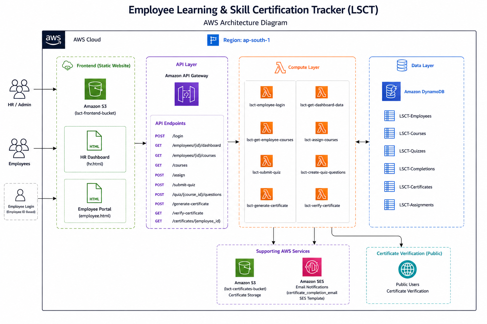
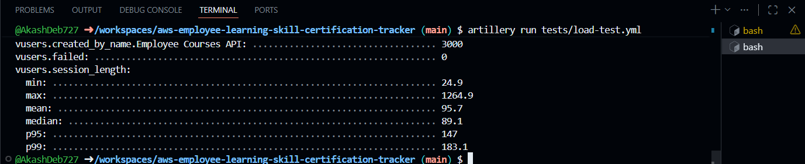

# 📚 Employee Learning & Skill Certification Tracker (AWS Serverless LMS)


> A cloud-native Learning Management System (LMS) built on AWS for employee training, assessments, progress tracking, and digital certification.

---

# 📖 Overview

The **Employee Learning & Skill Certification Tracker (LSCT)** is a cloud-native Learning Management System designed to help organizations manage employee training, course assignments, assessments, and certifications. HR administrators can create learning content, assign courses, monitor employee progress, and identify skill gaps across departments, while employees can complete assigned courses, take quizzes, track their progress, and download digitally generated certificates.

Built on a **serverless architecture**, the platform uses **AWS Lambda**, **Amazon API Gateway**, **Amazon DynamoDB**, **Amazon S3**, and **Amazon SES** to deliver a scalable, event-driven solution without managing traditional servers. The project also integrates **GitHub Actions** for CI/CD and **Artillery** for performance and load testing.

---

# 🚀 Key Highlights

- ☁️ Fully Serverless AWS Architecture
- 💻 Dedicated HR and Employee Portals
- 🔄 Automated CI/CD Pipeline using GitHub Actions
- 📈 Performance & Load Testing using Artillery
- ⚡ Event-Driven Backend using AWS Lambda
- 🌐 RESTful APIs powered by Amazon API Gateway
- 🗄️ Scalable NoSQL Database with Amazon DynamoDB
- 📄 Automated PDF Certificate Generation
- ✅ Public Certificate Verification
- 📧 Automated Email Notifications using Amazon SES
- 💾 Secure Certificate Storage in Amazon S3
- 📊 Employee Progress Tracking & Skill Gap Analysis

---

# ✨ Features

## 👨‍💼 HR Portal

- Interactive dashboard with employee learning statistics
- Create, update, and manage training courses
- Create and manage quizzes for each course
- Assign courses to individual employees or departments
- Monitor employee learning progress
- Track department-wise skill gaps
- Verify employee certificates through the verification portal

## 👨‍💻 Employee Portal

- Secure employee login
- Personalized learning dashboard
- View assigned training courses
- Access course learning materials
- Attempt quizzes with attempt tracking
- Monitor course completion progress
- Download generated course certificates

## ⚙️ Backend Features

- Serverless REST APIs using Amazon API Gateway
- Event-driven business logic with AWS Lambda
- Secure data storage using Amazon DynamoDB
- Automated PDF certificate generation
- Public certificate verification API
- Automated email notifications using Amazon SES
- Certificate storage using Amazon S3
- GitHub Actions CI/CD pipeline
- Performance testing using Artillery

---

# 🤝 Project Contributors

## Akash Deb

**Core Development**
- Quiz Engine
- Quiz grading
- Three-attempt limit
- Certificate generation
- Certificate verification
- Certificate storage in Amazon S3

**Additional Contributions**
- Developed the complete HR and Employee frontend
- Integrated the frontend with backend REST APIs
- Implemented a GitHub Actions CI/CD pipeline for automated deployment of the Employee Login AWS Lambda function
- Conducted Artillery load testing and performance analysis
- Assisted in project integration and end-to-end testing

## Ibrahim Ajmeri

- Developed the Course Catalogue module
- Implemented Course Creation APIs
- Built the Course Assignment workflow
- Configured Amazon SES notifications for course assignments
- Managed employee, course, and assignment data using Amazon DynamoDB
- Integrated course management and assignment functionality

## Rushi Sanku

- Developed the HR Skill Gap Dashboard
- Implemented employee progress tracking
- Built the department-wise skill matrix
- Highlighted overdue course assignments
- Configured weekly Amazon SNS alerts for HR administrators
- Integrated dashboard APIs with the application

---

# 🏗️ Architecture

The system follows a fully serverless, event-driven architecture on AWS. Amazon API Gateway exposes REST endpoints that trigger AWS Lambda functions for business logic, while Amazon DynamoDB provides low-latency data storage for employees, courses, and progress records. Amazon S3 stores generated certificates, and Amazon SES handles automated email notifications, resulting in a scalable system with no infrastructure to provision or manage.

<p align="center">
    
</p>

---

# 💻 Technology Stack

| Layer | Technology |
|-------|------------|
| Frontend | HTML, CSS, JavaScript |
| Backend | AWS Lambda (Node.js/Python) |
| API Layer | Amazon API Gateway |
| Database | Amazon DynamoDB |
| Storage | Amazon S3 |
| Notifications | Amazon SES |
| Alerts | Amazon SNS |
| CI/CD | GitHub Actions |
| Load Testing | Artillery |

---

# ☁️ AWS Services Used

| Service | Purpose |
|---------|---------|
| AWS Lambda | Event-driven backend business logic |
| Amazon API Gateway | Exposes RESTful API endpoints |
| Amazon DynamoDB | Stores employee, course, and progress data |
| Amazon S3 | Stores generated certificates |
| Amazon SES | Sends automated email notifications |
| Amazon SNS | Sends weekly skill-gap alerts to HR administrators |

---

# 🔄 CI/CD Pipeline

The project uses **GitHub Actions** to automate the deployment of the **Employee Login AWS Lambda function**. The pipeline follows a Build → Test → Deploy workflow, using the **AWS CLI** to publish the updated function code on every relevant change. Only the Employee Login Lambda function is deployed automatically through this pipeline; other components are deployed manually.

```text
GitHub Push
     │
     ▼
Build Stage  →  Install dependencies, package function code
     │
     ▼
Test Stage   →  Run automated tests
     │
     ▼
Deploy Stage →  Deploy Employee Login Lambda via AWS CLI
```

---

# 📈 Load Testing

To evaluate the application's performance under concurrent user traffic, load testing was performed using **Artillery** against the application's primary REST API endpoint.

### Test Configuration

| Parameter | Value |
|-----------|-------|
| Tool | Artillery |
| Concurrent Users | 50 |
| Duration | 60 Seconds |
| Target | REST API Endpoint |

### Metrics Collected

- Requests per Second (RPS)
- Error Rate
- Average Response Time
- P50 Latency
- P95 Latency
- P99 Latency

<p align="center">
    
</p>

The load test helped validate the responsiveness of the serverless backend under concurrent traffic, surface potential bottlenecks, and confirm stable API performance under simulated real-world usage.

---

# 📂 Project Structure

```text
aws-employee-learning-skill-certification-tracker/
│
├── .github/
│   └── workflows/
│       └── deploy.yml
│
├── architecture/
│   └── architecture-diagram.png
│
├── frontend/
│
├── lambda/
│
├── artillery/
│   ├── load-test.yml
│   ├── artillery-test.png
│   └── report.pdf
│
├── screenshots/
│   ├── aws/
│   ├── employee/
│   └── hr/
│
└── README.md
```
